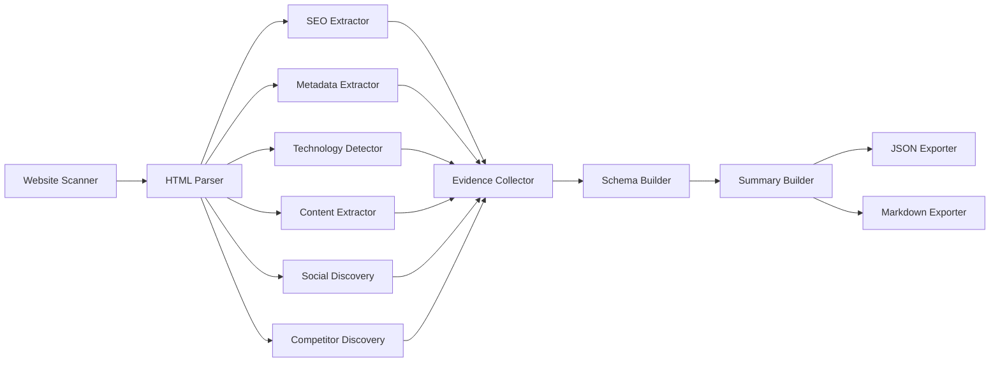

# AIFME Scout OSS

**Open-source website and marketing intelligence toolkit**

Point it at a URL; get a structured, evidence-linked snapshot of what a business is, how its site is built, and how it compares to named competitors.

[Python](https://www.python.org/downloads/) [](https://www.python.org/downloads/) [](https://opensource.org/licenses/Apache-2.0) [](https://pypi.org/project/aifme-scout/) [](https://github.com/SureshBabuoo7/aifme-scout/actions/workflows/ci.yml)

---

## What is AIFME Scout OSS?

AIFME Scout OSS is a free, open-source, self-hosted toolkit that scans a URL and produces a deterministic, evidence-linked snapshot of a website's public-facing identity — its technology stack, SEO signals, structured content, metadata, social profiles, and competitor references. It exposes both a command-line interface and a REST API, and outputs a versioned JSON schema alongside a Markdown report.

It performs the **Understand** step of the AIFME model and nothing past it: no persistent memory, no reasoning logic, no action on a target's behalf. The commercial [AIFME Platform](https://aifme.com) adds Remember, Reason, Decide, Execute, and Measure. Scout OSS is the open-source foundation.

---

## Features

- **Website Scanning** — Safe HTTP fetch with SSRF protection, robots.txt awareness, configurable timeouts, and retry logic
- **HTML Parsing** — Lenient DOM tree construction with deterministic extraction from malformed markup
- **SEO Extraction** — Titles, meta descriptions, canonical URLs, heading hierarchy, Open Graph, Twitter Cards, structured data, hreflang, AMP
- **Metadata Extraction** — Favicons, language, manifests, RSS/Atom feeds, verification tags, resource hints, CSP
- **Technology Detection** — Rule-based detection of frameworks, CMS, web servers, analytics, CSS frameworks, CDN, and security headers
- **Content Extraction** — Structured body content: headings, paragraphs, lists, tables, images, links, buttons, forms, breadcrumbs, footers, contact info
- **Social Discovery** — Platform detection from page links, JSON-LD sameAs, Font Awesome icon classes
- **Competitor Discovery** — Explicit declarations, "vs" headings, schema.org markup, user-supplied lists
- **Evidence Collection** — Normalized, traceable evidence model with deterministic IDs and confidence levels
- **Schema Validation** — Every result validated against a versioned JSON Schema before export
- **JSON Export** — Pretty-printed, schema-compliant JSON with stable key ordering
- **Markdown Export** — CEO-grade executive intelligence reports with health scores and evidence-linked takeaways
- **CLI** — Full-featured command-line interface with configuration precedence, exit codes, and output control
- **REST API** — FastAPI-based HTTP interface with automatic OpenAPI/Swagger documentation

---

## Installation

### Prerequisites

- Python 3.11 or higher
- pip or compatible package manager

### Install from PyPI

```bash
pip install aifme-scout
```

### Upgrade

```bash
pip install --upgrade aifme-scout
```

### Virtual Environment (Recommended)

```bash
python -m venv .venv
source .venv/bin/activate  # Windows: .venv\Scripts\Activate.ps1 (PowerShell) or .venv\Scripts\activate (Command Prompt)
pip install aifme-scout
```

### Editable Install (Development)

```bash
git clone https://github.com/SureshBabuoo7/aifme-scout.git
cd aifme-scout
python -m venv .venv
source .venv/bin/activate  # Windows: .venv\Scripts\Activate.ps1 (PowerShell) or .venv\Scripts\activate (Command Prompt)
pip install -e ".[dev]"
pre-commit install
```

---

## Quick Start

### Scan a Website

```bash
# Basic scan — outputs JSON and Markdown to current directory
aifme-scout scan https://www.python.org

# Scan with custom timeout
aifme-scout scan https://www.python.org --timeout 30

# JSON output only
aifme-scout scan https://www.python.org --output json --out ./reports

# Markdown report only
aifme-scout scan https://www.python.org --output markdown --out ./reports

# Quiet mode (errors only)
aifme-scout scan https://www.python.org --quiet
```

Output files are written to the output directory:
- `scan-result.json` — Schema-validated JSON report
- `report.md` — Markdown executive report

### Start the REST API

```bash
uvicorn aifme_scout.api.app:app --host 0.0.0.0 --port 8000
```

Interactive documentation:
- Swagger UI: http://localhost:8000/docs
- ReDoc: http://localhost:8000/redoc

### Python API

```python
from aifme_scout.engine.request_handler import handle
from aifme_scout.utils.models import ScanRequest

request = ScanRequest(
    target_url="https://www.python.org",
    competitor_urls=["https://example.com"],
    mode="no-llm"
)
result = handle(request)

# Access structured results
print(result.summary.text)
print(f"Evidence items: {result.summary.diagnostics.total_evidence_items}")
```

---

## Sample Report

### CLI Output

```text
$ aifme-scout scan https://www.python.org

[INFO] Scanning https://www.python.org
[INFO] Fetched 1 page(s) in 2.5s
[INFO] Collected 347 evidence items
[INFO] Classification: Programming Language Documentation Portal (confidence: high)
[INFO] Health Score: 85/100
[INFO] Report written to report.md
[INFO] JSON written to scan-result.json
```

### Markdown Report

The Markdown report (`report.md`) contains the following sections:

1. **Executive Summary** — One-paragraph business overview with health score
2. **Scan Limitations** — Transparent disclosure of what could not be extracted (anti-bot, robots.txt, JS rendering)
3. **Website Classification** — Deterministic business category with confidence level
4. **SEO Summary** — Titles, meta descriptions, headings, Open Graph, structured data
5. **Technology Summary** — Detected frameworks, CMS, servers, analytics, security headers
6. **Content Summary** — Heading distribution, content volume, key pages
7. **Social Presence** — Discovered social profiles with provenance
8. **Competitor Summary** — Resolved competitor comparison set
9. **Diagnostics** — Evidence counts, coverage percentages, scan metadata
10. **Data Completeness** — Missing data explained with remediation guidance


### JSON Output

The JSON output (`scan-result.json`) is a versioned, schema-validated document:

```json
{
  "meta": {
    "schema_version": "1.0.0",
    "engine_version": "1.0.0",
    "timestamp": "2026-08-05T07:14:26+00:00"
  },
  "site": {
    "url": "https://www.python.org",
    "target_url": "https://www.python.org"
  },
  "seo": [...],
  "metadata": [...],
  "technology": [...],
  "content": [...],
  "social": [...],
  "competitors": [...],
  "evidence": [...],
  "diagnostics": {
    "total_evidence_items": 347,
    "seo_items": 13,
    "technology_items": 7,
    "content_items": 300,
    "metadata_items": 23,
    "social_items": 4,
    "competitor_items": 0
  }
}
```

Every evidence item includes a deterministic ID, provenance (DOM path, tag, original text), confidence level, and traceable source URL.


---

## Architecture

Scout OSS follows a deterministic, stateless pipeline. The same orchestration logic is shared by the CLI and REST API through a single Request Handler.



**Request Handler** orchestrates the pipeline. No logic is duplicated across interfaces.

All modules are frozen, immutable, and thread-safe. The JSON Schema is versioned independently from the engine version.

---

## Validation

Scout OSS v1.0.0 passed comprehensive release validation across 10 real-world websites:

| Metric | Value |
|--------|-------|
| Total sites | 10 |
| PASS | 9 |
| LIMITED | 1 (reddit.com — robots.txt disallows crawl) |
| FAIL | 0 |
| No crashes | Yes |
| JSON output verified | 9 / 10 |
| Markdown output verified | 9 / 10 |
| Deterministic output | Yes |

---

## Limitations

AIFME Scout OSS is intentionally scoped. These are honest limitations, not bugs:

- **No browser rendering** — JavaScript-generated content is not executed. Sites relying entirely on client-side rendering will appear empty.
- **No JavaScript execution** — Scout OSS does not run a headless browser. Static HTML only.
- **robots.txt is respected** — Sites that disallow crawling will return `LIMITED` status. This is expected behavior, not a failure.
- **Anti-bot protection is respected** — Cloudflare, Imperva, Datadome, and CAPTCHA challenges are detected and reported. Scout OSS will not bypass them.
- **No persistent memory** — Each scan is independent. No history, no comparisons across runs.
- **No reasoning or decision logic** — Scout OSS extracts and classifies. It does not act on a target's behalf.
- **Technology detection is rule-based** — Custom or internal frameworks may not be detected without explicit rules.
- **Competitor heuristic discovery** — Requires an explicit `target_classification` for best results.

See [docs/LIMITATIONS.md](docs/LIMITATIONS.md) for the complete limitations reference.

---

## Roadmap

| Milestone | Focus | Status |
|-----------|-------|--------|
| v1.1.x | Bug fixes, security patches, minor improvements | Planned |
| v2.0.0 | Plugin system, extended schema, enhanced classification | Planned |
| AIFME Platform | Remember, Reason, Decide, Execute, Measure | Commercial |

Scout OSS is in **maintenance mode** as of v1.0.0. Only P0/P1 bug fixes and security updates are accepted. Engineering focus has shifted to the AIFME Platform. See [MAINTENANCE.md](MAINTENANCE.md) for details.

Community contributions are still welcome and will be reviewed against the maintenance criteria.

---

## Contributing

We welcome contributions. Please see [CONTRIBUTING.md](CONTRIBUTING.md) for development setup, testing, and pull request guidelines.

### Quick Start for Contributors

```bash
# Clone and setup
git clone https://github.com/SureshBabuoo7/aifme-scout.git
cd aifme-scout
python -m venv .venv
source .venv/bin/activate  # Windows: .venv\Scripts\activate
pip install -e ".[dev]"
pre-commit install

# Run tests
pytest

# Lint
ruff check src/ tests/

# Type check
mypy src/

# Format
black src/ tests/
```

### Code of Conduct

This project adheres to the [Contributor Covenant Code of Conduct](CODE_OF_CONDUCT.md). By participating, you are expected to uphold this code.

### Reporting Issues

- **Bugs:** [GitHub Issues](https://github.com/SureshBabuoo7/aifme-scout/issues) with the `bug` label
- **Features:** [GitHub Issues](https://github.com/SureshBabuoo7/aifme-scout/issues) with the `enhancement` label (note: feature requests are not prioritized during maintenance mode unless required by AIFME)
- **Security:** [SECURITY.md](SECURITY.md) — do not open public issues for vulnerabilities
- **Questions:** [GitHub Discussions](https://github.com/SureshBabuoo7/aifme-scout/discussions)

---

## Links

- [Documentation](docs/)
- [Contributing Guide](CONTRIBUTING.md)
- [Security Policy](SECURITY.md)
- [Code of Conduct](CODE_OF_CONDUCT.md)
- [Support](SUPPORT.md)
- [FAQ](FAQ.md)
- [Changelog](CHANGELOG.md)
- [Roadmap](ROADMAP.md)
- [Schema Changelog](SCHEMA_CHANGELOG.md)
- [Maintenance Policy](MAINTENANCE.md)

---

Built with ❤️ by [AIFME](https://aifme.com)

[GitHub](https://github.com/SureshBabuoo7/aifme-scout) · [PyPI](https://pypi.org/project/aifme-scout/) · [Apache 2.0](https://github.com/SureshBabuoo7/aifme-scout/blob/master/LICENSE)
