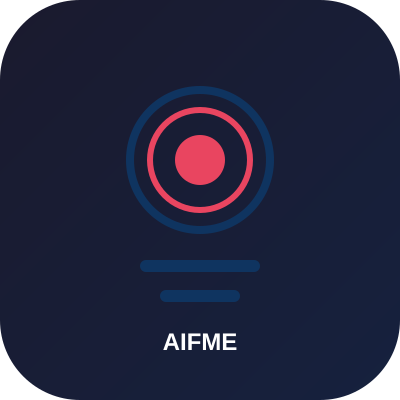
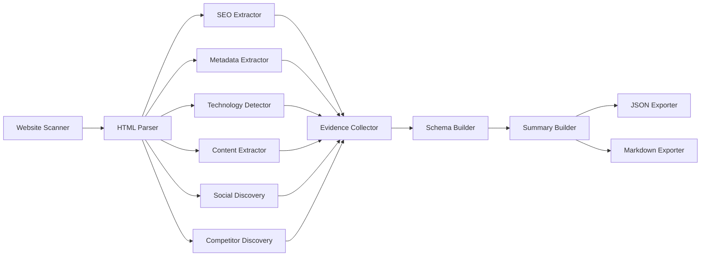
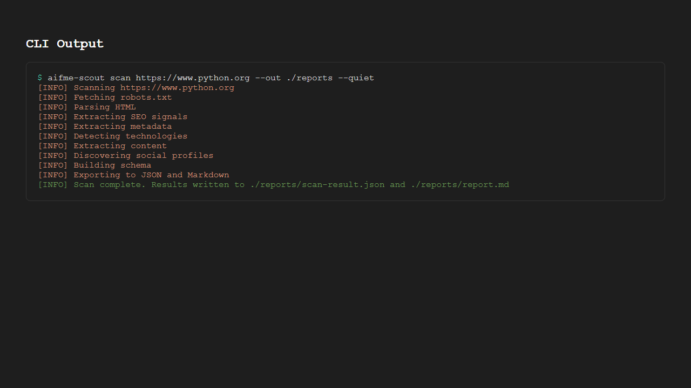
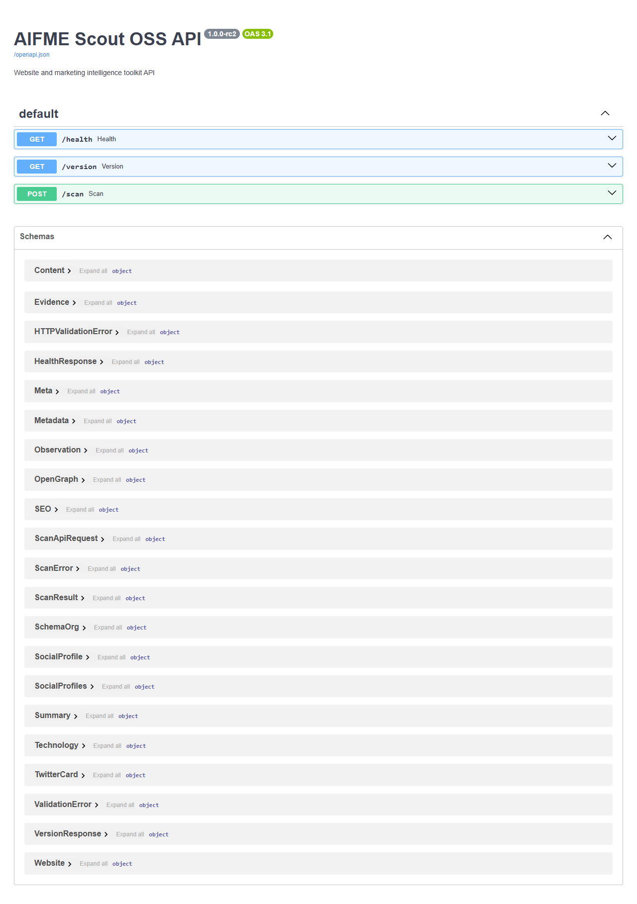
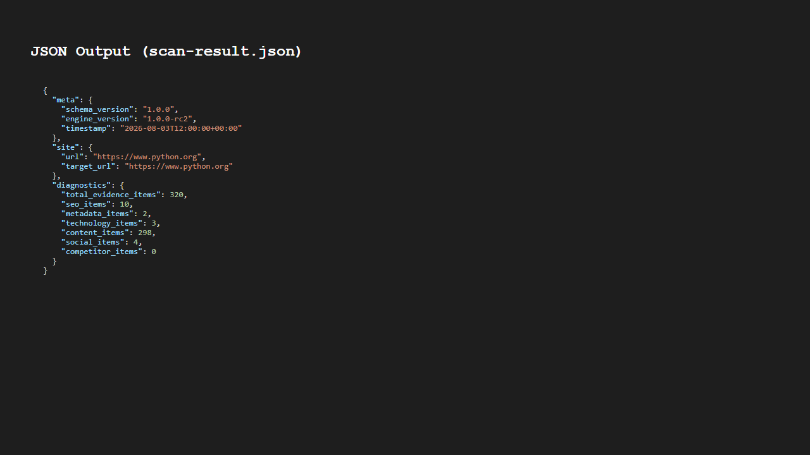
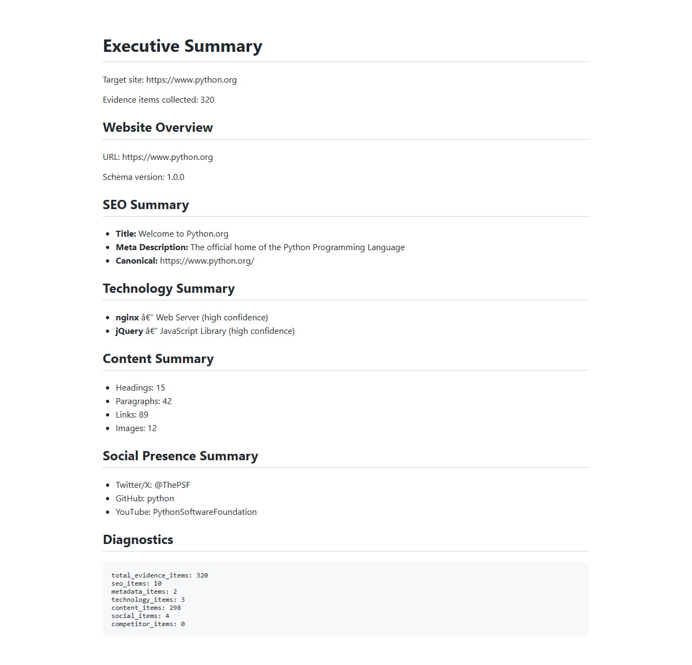

<p align="center">
  
</p>

<h1 align="center">AIFME Scout OSS</h1>

<p align="center">
  <strong>Open-source website and marketing intelligence toolkit</strong>
  <br>
  Point it at a URL; get a structured, evidence-linked snapshot of what a business is, how its site is built, and how it compares to named competitors.
</p>

<p align="center">
  <a href="https://www.python.org/downloads/"></a>
  <a href="https://opensource.org/licenses/Apache-2.0"></a>
  <a href="https://pypi.org/project/aifme-scout/"></a>
  <a href="https://github.com/psf/black"></a>
  <a href="https://docs.astral.sh/ruff/"></a>
  <a href="https://github.com/SureshBabuoo7/aifme-scout/actions/workflows/ci.yml"></a>
</p>

---

## What is Scout OSS?

AIFME Scout OSS is the **free, open-source, self-hosted** entry point into AIFME's marketing-intelligence capability. It performs the **Understand** step of the AIFME model and nothing past it.

- No persistent memory
- No reasoning or decision logic
- No ability to act on a target's behalf

It is a standalone extraction toolkit that gives you a structured, evidence-linked snapshot of a website's public-facing identity — ready for humans or AI agents to consume.

The commercial [AIFME Platform](https://aifme.com) includes Remember, Reason, Decide, Execute, and Measure capabilities. Scout OSS is the open-source foundation.

---

## Features

| Feature | Description |
|---------|-------------|
| **Website Scanning** | Safely fetch and analyze websites with configurable timeouts, crawl delays, and SSRF protection |
| **HTML Parsing** | Convert raw HTML into a deterministic, navigable DOM tree with lenient recovery for malformed markup |
| **SEO Extraction** | Extract on-page SEO signals: titles, meta descriptions, canonical URLs, heading hierarchy, Open Graph, Twitter Cards, structured data |
| **Metadata Extraction** | Pull structured head metadata: favicons, language, manifest links, RSS/Atom feeds, verification tags |
| **Technology Detection** | Identify frameworks, CMS platforms, web servers, analytics tools, and CSS frameworks with rule-based confidence |
| **Content Extraction** | Extract structured body content: headings, paragraphs, lists, tables, images, links, buttons, forms, breadcrumbs, footers |
| **Social Discovery** | Find linked social profiles from parsed page links with platform detection and provenance tracking |
| **Competitor Discovery** | Assemble competitor comparison sets from explicit declarations and user-supplied lists |
| **Evidence Collection** | Normalize all extractor outputs into a common, traceable evidence model with deterministic IDs |
| **Schema Validation** | Validate every scan result against a versioned JSON Schema before export |
| **JSON Export** | Pretty-printed, schema-compliant JSON output with stable key ordering |
| **Markdown Export** | Deterministic Markdown reports preserving all section headings and evidence references |
| **CLI** | Full-featured command-line interface with configuration precedence, exit codes, and output control |
| **REST API** | FastAPI-based HTTP interface with automatic OpenAPI/Swagger documentation |

---

## Architecture



The **Request Handler** is the single orchestration entry point for both the CLI and REST API. No pipeline logic is duplicated across interfaces.

All modules are frozen, immutable, and thread-safe. The JSON Schema is versioned independently from the engine version.

---

## Installation

### Prerequisites

- Python 3.11 or higher
- pip or compatible package manager

### Install from PyPI

```bash
pip install aifme-scout
```

### Editable Install (Development)

```bash
git clone https://github.com/SureshBabuoo7/aifme-scout.git
cd aifme-scout
python -m venv .venv
source .venv/bin/activate  # Windows: .venv\Scripts\activate
pip install -e ".[dev]"
pre-commit install
```

---

## Quick Start

### Scan a Website

```bash
# Basic scan
aifme-scout scan https://www.python.org

# Or run as a module
python -m aifme_scout scan https://www.python.org
```

Output files are written to the current directory:
- `scan-result.json` — Schema-validated JSON report
- `report.md` — Markdown summary

### Start the REST API

```bash
uvicorn aifme_scout.api.app:app --host 0.0.0.0 --port 8000
```

Interactive documentation:
- Swagger UI: http://localhost:8000/docs
- ReDoc: http://localhost:8000/redoc

---

## Screenshots

### CLI Output



### Swagger UI



### JSON Report Sample



### Markdown Report Sample



---

## Architecture Overview

Scout OSS follows a deterministic, stateless pipeline:

1. **Website Scanner** — Fetches raw HTML with transport metadata
2. **HTML Parser** — Builds a navigable DOM tree
3. **SEO Extractor** — Derives on-page SEO signals
4. **Metadata Extractor** — Extracts structured head metadata
5. **Technology Detector** — Identifies technology fingerprints
6. **Content Extractor** — Extracts structured body content
7. **Social Discovery** — Finds linked social profiles
8. **Competitor Discovery** — Assembles competitor comparison sets
9. **Evidence Collector** — Normalizes extractor outputs into evidence items
10. **Schema Builder** — Assembles and validates the `ScoutSchema`
11. **Summary Builder** — Generates deterministic, evidence-linked summaries
12. **JSON Exporter** — Serializes schema to stable JSON
13. **Markdown Exporter** — Renders summary to Markdown

### Repository Structure

```
aifme-scout/
├── .github/              # GitHub configuration (CI, issue templates, CODEOWNERS)
├── assets/               # Brand assets (logo, banner)
├── docs/                 # Documentation
│   ├── architecture.md   # Module-level architecture documentation
│   ├── api-guide.md      # API usage and examples
│   ├── cli-guide.md      # CLI usage and examples
│   ├── schema.md         # JSON Schema documentation
│   ├── faq.md            # Frequently asked questions
│   └── migration-guide.md # Migration guidance
├── examples/             # Sample scans and screenshots
├── schemas/              # Versioned JSON schemas
│   └── v1/
│       └── scan-result.schema.json
├── tests/                # Test suite
│   ├── unit/             # Unit tests
│   └── integration/      # Integration tests
├── src/                  # Source code
│   ├── aifme_scout/
│   │   ├── cli/          # CLI module
│   │   ├── api/          # REST API module (FastAPI)
│   │   ├── engine/       # Orchestration and assembly
│   │   ├── scanner/      # Fetch and transport
│   │   ├── parser/       # HTML parsing
│   │   ├── extractors/   # Extraction modules
│   │   ├── exporters/    # Output rendering
│   │   └── utils/        # Cross-cutting helpers
├── scripts/              # Dev/release tooling
└── pyproject.toml        # Project configuration
```

---

## Roadmap

| Milestone | Name | Status |
|---|---|---|
| EXEC-01 | Repository Foundation | Done |
| EXEC-02 | Development Environment | Done |
| EXEC-03 | Core Infrastructure | Done |
| EXEC-04 | Website Scanner | Done |
| EXEC-05 | HTML Parser | Done |
| EXEC-06 | SEO Extractor | Done |
| EXEC-07 | Metadata Extractor | Done |
| EXEC-08 | Technology Detector | Done |
| EXEC-09 | Content Extractor | Done |
| EXEC-10 | Social Discovery | Done |
| EXEC-11 | Competitor Discovery | Done |
| EXEC-12 | Evidence Collector | Done |
| EXEC-13 | Schema Builder | Done |
| EXEC-14 | Summary Builder | Done |
| EXEC-15 | JSON Exporter | Done |
| EXEC-16 | Markdown Exporter | Done |
| EXEC-17 | CLI | Done |
| EXEC-18 | REST API | Done |
| EXEC-19 | Testing Completion | Done |
| EXEC-20 | Documentation Completion | Done |
| EXEC-21 | Release Candidate | Done |
| EXEC-22 | Public Launch | In Progress |

See [ROADMAP.md](./ROADMAP.md) for detailed milestone specifications.

---

## FAQ

<details>
<summary><strong>What is Scout OSS?</strong></summary>

AIFME Scout OSS is a free, open-source, self-hosted tool that scans a URL and returns a structured, evidence-linked snapshot of a business's web presence, technology stack, and marketing signals. It provides both a CLI and a REST API, with output as a versioned JSON schema.

</details>

<details>
<summary><strong>How is it different from AIFME Platform?</strong></summary>

Scout OSS performs the **Understand** step of the AIFME model and nothing past it. It has no persistent memory, no reasoning or decision logic, and no ability to act on a target's behalf. The AIFME Platform includes Remember, Reason, Decide, Execute, and Measure capabilities that are not part of this open-source project.

</details>

<details>
<summary><strong>Why is the Brain not included?</strong></summary>

The Brain is part of the commercial AIFME Platform and is outside the scope of Scout OSS. Scout OSS is a standalone extraction toolkit. It does not depend on or include any Platform-internal components.

</details>

<details>
<summary><strong>What output formats are supported?</strong></summary>

Scout OSS produces two output formats:
- **JSON** — Schema-validated, pretty-printed with stable key ordering
- **Markdown** — Deterministic reports preserving all section headings and evidence references

</details>

<details>
<summary><strong>How is the JSON Schema versioned?</strong></summary>

The JSON Schema is versioned independently from the engine version. The current schema version is `1.0.0`, and the engine version is `1.0.0-rc2`. Schema changes follow the [SCHEMA_CHANGELOG.md](./SCHEMA_CHANGELOG.md).

</details>

<details>
<summary><strong>Can I use Scout OSS for commercial purposes?</strong></summary>

Yes. Scout OSS is licensed under the [Apache License 2.0](./LICENSE), which permits commercial use, modification, distribution, and private use.

</details>

See [FAQ.md](./FAQ.md) for more frequently asked questions.

---

## Contributing

We welcome contributions! Please see [CONTRIBUTING.md](./CONTRIBUTING.md) for development setup, testing, and pull request guidelines.

### Quick Contributing Guide

1. Fork the repository
2. Create a feature branch (`git checkout -b feature/my-new-feature`)
3. Make your changes
4. Run tests (`pytest`)
5. Run lint (`ruff check src/ tests/`)
6. Run type check (`mypy src/`)
7. Commit your changes (`git commit -m 'feat: add new feature'`)
8. Push to the branch (`git push origin feature/my-new-feature`)
9. Open a Pull Request

---

## Development Setup

```bash
git clone https://github.com/SureshBabuoo7/aifme-scout.git
cd aifme-scout
python -m venv .venv
source .venv/bin/activate  # Windows: .venv\Scripts\activate
pip install -e ".[dev]"
pre-commit install
```

## Running Tests

```bash
# Run all tests
pytest

# Run with coverage
pytest --cov=aifme_scout --cov-report=term-missing

# Run specific test file
pytest tests/unit/test_cli.py
```

## Code Quality

```bash
# Lint
ruff check src/ tests/

# Type check
mypy src/

# Format check
black --check src/ tests/
```

---

## Links

- [Documentation](./docs/)
- [Contributing](./CONTRIBUTING.md)
- [Security Policy](./SECURITY.md)
- [Code of Conduct](./CODE_OF_CONDUCT.md)
- [Support](./SUPPORT.md)
- [FAQ](./FAQ.md)
- [Changelog](./CHANGELOG.md)
- [Roadmap](./ROADMAP.md)
- [Schema Changelog](./SCHEMA_CHANGELOG.md)

---

<p align="center">
  Built with ❤️ by <a href="https://aifme.com">AIFME</a>
</p>
